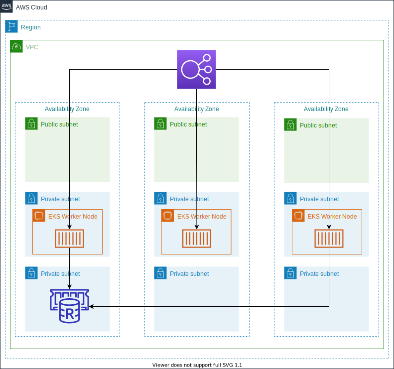

# Java Service on EKS Example

This repository aims to show how a stateful Java Service can be deployed on EKS. To still being able to scale the service Amazon ElastiCache is used to persist the state at a central place.

Remarks: 
The Java code bases from this Java Blog https://www.javainuse.com/spring/springboot_session_redis. The code in this repo has added functionalities and customizations to make it run in a container environment working with Amazon ElastiCache Redis. Thanks for the contribution of the before mentioned blogger.

**Be aware that the deployment is not covered by the AWS free tier. Please use the [AWS pricing calculator](https://calculator.aws/#/estimate) to an estimation beforehand**

# Table of Contents

1. [Prerequisites](#Prerequisites)
2. [Architecture](#Architecture)
3. [Service Overview](#Service-Overview)
4. [Deploying the infrastructure](#Deploying-the-infrastructure)
5. [Initializing your local environment](#Initializing-your-local-environment)
6. [Deploying the Java service](#Deploying-the-Java-service)
7. [Destroying the environment](#Destroying-the-environment)
8. [Further Reading](#Further-Reading)
9. [Security](#Security)
10. [License](#License)

## Prerequisites

Before starting to deploy, following dependencies need to be installed in your environment. If you do not want to set this up on your local machine, you can use [AWS Cloud9](https://aws.amazon.com/cloud9/). AWS Cloud9 is a cloud-based integrated development environment (IDE) that lets you write, run, and debug your code with just a browser. It includes a code editor, debugger, and terminal. 

1. [AWS account](https://signin.aws.amazon.com/signin?redirect_uri=https%3A%2F%2Fportal.aws.amazon.com%2Fbilling%2Fsignup%2Fresume&client_id=signup)
2. [aws cli](https://docs.aws.amazon.com/cli/latest/userguide/install-cliv2.html)
3. [jq](https://stedolan.github.io/jq/download/)
4. [kubernetes cli](https://kubernetes.io/docs/tasks/tools/install-kubectl/)
5. [Maven](https://maven.apache.org/install.html)
6. [Docker](https://docs.docker.com/get-docker/)

## Architecture



### Service Overview

Amazon Elastic Kubernetes Service (Amazon EKS) manages the Kubernetes Control Plane. In this example we are using an Amazon EKS Managed Node Group to add worker nodes to our cluster. All applications containers will run on these nodes. To keep the example as simple as possible, we are using the Kubernetes service type `LoadBalancer` to route traffic to the application. When using Amazon EKS clusters this automatically creates a Classic Load Balancer that uses Node Ports to route traffic to the application. Please have a look into the [Application load balancing on Amazon EKS edocumentation](https://docs.aws.amazon.com/eks/latest/userguide/alb-ingress.html) if you want to use an Application or Network Load Balancer to control ingress. 

To store and share session data across all Java services we are using Amazon ElastiCache Redis. 

## Deploying the infrastructure

This repository contains a set of Cloudformation Templates that set up the required infrastructure seen in the architecture diagram. To make the setup as easy as possible, this repository also contains a deployment script `deploy.sh` that issues all the necessary CLI commands. The script has one required argument `-p` that reflects the aws cli profile that should be used. Please have a look into the [Named Profiles documentation](https://docs.aws.amazon.com/cli/latest/userguide/cli-configure-profiles.html) to setup a profile before continuing.

If the profile is already present the deployment can be started using following command:

```
./deploy.sh -p <profile name>
```  

The creation of the infrastructure will roughly take 30 minutes.

The Cloudformation template has following parameters that can be changed:

| Parameter Name            | Description                                       | Type               | Default Value                       |
| ------------------------- | ------------------------------------------------- |------------------- |-------------------------------------|
| TemplatePath              | Base path of template location within S3          | String             | -                                   |
| VPCcidr                   | VPC CIDR CidrBlock                                | String             | 10.0.0.0/16                         |
| PublicSubnets             | Public Subnets                                    | CommaDelimitedList | 10.0.1.0/24,10.0.2.0/24,10.0.3.0/24 |
| PrivateSubnets            | Private Subnets                                   | CommaDelimitedList | 10.0.4.0/24,10.0.5.0/24,10.0.6.0/24 |
| PrivateDBSubnets          | Private DB Subnet                                 | CommaDelimitedList | 10.0.7.0/24,10.0.8.0/24,10.0.9.0/24 |
| EKSWorkerNodeInstanceType | Instance type used for the EKS Managed Node Group | String             | t3.micro                            |
| EKSNodeGroupMinSize       | Minimum Size of the EKS Node Group                | Number             | 1                                   |
| EKSNodeGroupMaxSize       | Maximum Size of the EKS Node Group                | Number             | 10                                  |
| EKSNodeGroupDesiredSize   | Desired Size of the EKS Node Group                | Number             | 3                                   |
| RedisInstanceType         | Instance type used for the Redis instance         | String             | cache.t3.micro                      |
| CacheAZMode               | Redis Cache AZ Mode                               | String             | single-az                           |


## Initializing your local environment

After the deployment finished, there are some additional steps required to initialize the local environment:

1. Update the local kubeconfig to configure the kubectl with the created cluster
2. Update the k8s-resources/config-map.yaml to the created Redis Database Address
3. Build and package the Java Service
4. Build and push the Docker image
5. Update the k8s-resources/deployment.yaml to use the newly created image

These steps can be automatically executed using the init.sh. The script needs following parameter:

1. `-u` - Docker Hub User Name
2. `-r` - Repository Name
3. `-t` - Docker image version tag

A sample invocation looks like this: `./init.sh -u bastianklein -r java-ms -t 1.2`.

This information is used to concatenate the full docker repository string. In the above example this would resolve to: `bastianklein/java-ms:1.2`

## Deploying the Java service

As everything is set up, it is time to deploy the Java service. Below list of commands first deploys all Kubernetes resources and then lists pods and services.

```
kubectl apply -f k8s-resources/
```

This will output something similar to:

```
configmap/java-ms created
deployment.apps/java-ms created
service/java-ms created
```

Now lets list the freshly created pods by issuing `kubectl get pods`.

```
NAME                       READY   STATUS              RESTARTS   AGE
java-ms-69664cc654-7xzkh   0/1     ContainerCreating   0          1s
java-ms-69664cc654-b9lxb   0/1     ContainerCreating   0          1s
```

Lets also have a look into the created service `kubectl get svc`.

```
NAME         TYPE           CLUSTER-IP      EXTERNAL-IP                                                                 PORT(S)        AGE    SELECTOR
java-ms      LoadBalancer   172.20.83.176   ***-***.eu-central-1.elb.amazonaws.com                                      80:32300/TCP   33s    app=java-ms
kubernetes   ClusterIP      172.20.0.1      <none>                                                                      443/TCP        2d1h   <none>
```

What we can see here is that the Service with name `java-ms` has an External-IP assigned to it. This is the DNS Name of the Classic Loadbalancer that is created behind the scenes. If you open that URL, you should see the Website (This might take a few minutes for the ELB to be provisioned).

## Destroying the environment

After you finished testing you can destroy the environment by issuing `./destroy.sh -p <profile name>` and replace the placeholder with your profile name.

## Further Reading

* [Running stateful workloads with Amazon EKS on AWS Fargate using Amazon EFS](https://aws.amazon.com/blogs/containers/running-stateful-workloads-with-amazon-eks-on-aws-fargate-using-amazon-efs/)

## Security

See [CONTRIBUTING](CONTRIBUTING.md#security-issue-notifications) for more information.

## License

This library is licensed under the MIT-0 License. See the LICENSE file.

### Third Party Licensing

Please be aware of the deviating licenses of the deployed open-source software components.

* Spring Boot: [Apache License 2.0](https://github.com/spring-projects/spring-boot/blob/master/LICENSE.txt)
* Spring Boot Starter Parent: [Apache License 2.0](https://github.com/bitmc/spring-boot-starter-parent/blob/main/LICENSE.txt)
* Lettuce - Advanced Java Redis client: [Apache License 2.0](https://github.com/lettuce-io/lettuce-core/blob/main/LICENSE)
* MojoHaus Exec Maven Plugin: [Apache License 2.0](https://github.com/mojohaus/exec-maven-plugin/blob/master/LICENSE.txt)
